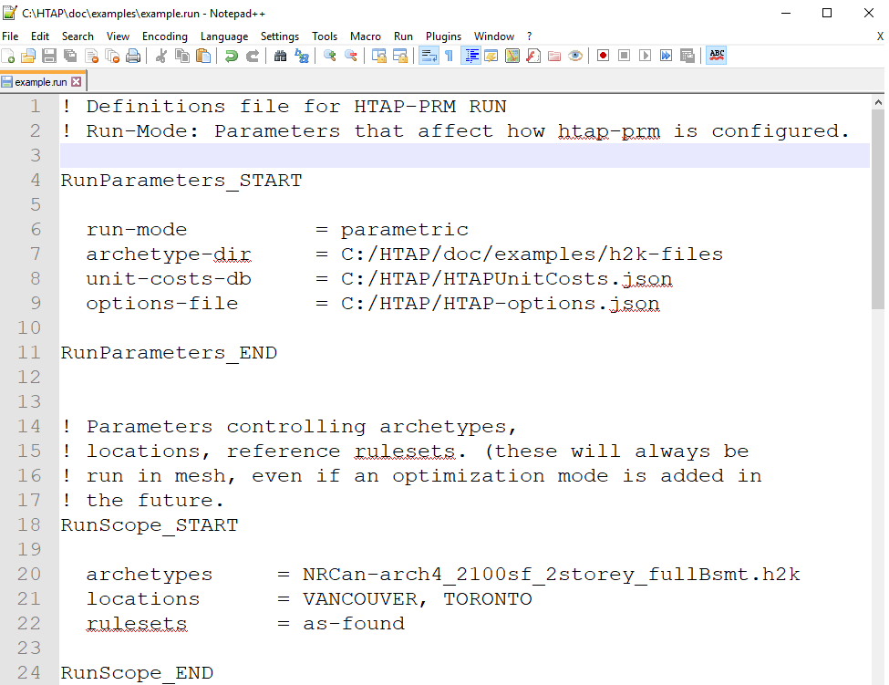
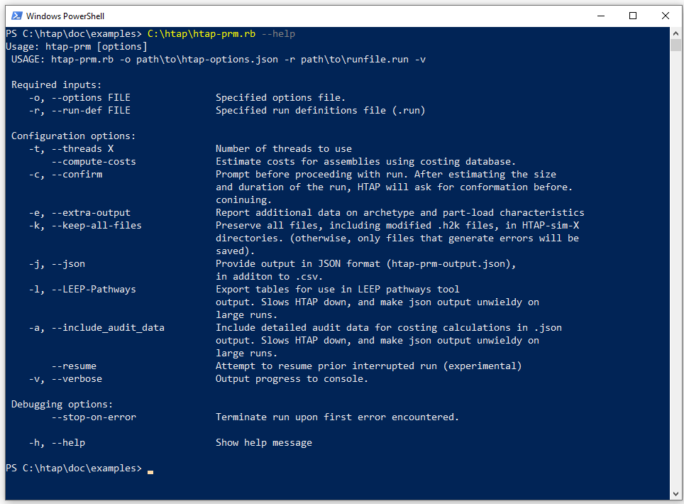
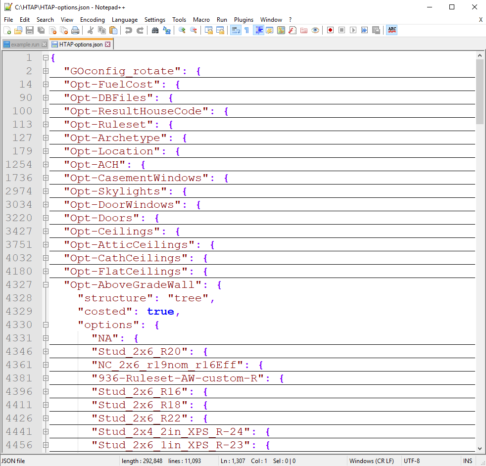

# HTAP: A quick start guide #

Before following this guide, you must first install HTAP using the instructions in `HTAP-installation.md`. All examples in this guide use the files located in `HTAP\doc\examples\`. #

##### Working with HTAP files 

1. [Editing text files](#editingFiles)
2. [Using the command line](#commandLine)

##### Running HTAP

1. [Using `htap-prm.rb` for HOT2000 batch processing](#batchProcessing)
2. [The `.run` file](#runFile)
3. [The `.options` file](#optionsFile)
4. [Changing the house models (.h2k files)](#changingh2k)
5. [Adding other locations](#addingLoc)
6. [Specifying different upgrades]()
7. [Analyzing results]()

##### Troubleshooting

8. [Interpreting HTAP PRM output]()
9. [Reading simulation log files]()

##### Advanced topics

10. [Multi-threaded runs]()
11. [Capital cost calculations]()
12. [Retaining simulation files]()
13. [Resuming interrupted runs]()
14. [`.json` output]()

##### Developing with HTAP
15. TBD

<a name="editingFiles"></a>

## 1. Editing HTAP files

HTAP doesn't have a user interface. To work with HTAP, you must use a text editor to change ascii input files. While most windows computers include a free notepad application, we recommend using a program specifically designed to edit ascii files. 

If you don't already have such a program, you can download Notepad++ for free at <https://notepad-plus-plus.org/>

|  |
| ------------------------------------ |
| Editing HTAP files in Notepad ++     |

<a name="batchProcessing"></a>

## 2. Using the command line 

To invoke HTAP,  you will enter commands in the windows command line console. Look for a program called Windows PowerShell. 

Once you have started the shell, navigate to the HTAP directory.

- Type `C:\HTAP`  to navigate to the root HTAP directory
- Type `C:\HTAP\doc\examples` to navigate to the example directory used in this guide.
- Type `C:\HTAP\htap-prm.rb --help` to learn more about invoking HTAP's parallel run manager.

|             |
| -------------------------------------------- |
| Invoking `htap-prm.rb` from the command line |

<a name="batchProcessing"></a>

## 1. Using  `htap-prm.rb` for batch HOT2000 processing

`HTAP-prm.rb` is a parallel run manager that can configure and dispatch multiple HOT2000 
simulations over parallel threads, and recover their output. For input, you must 
supply `htap-prm.rb` with a `.run` file, which contains pointers to other databases 
that HTAP should use, configuration options for the analysis, and instructions for changing hot2000 files. 

To start an HTAP run, use the following command:

    > htap-prm.rb -r [run-file] -v -c

#### Example:

```
C:\HTAP\doc\examples> C:\htap\htap-prm.rb -r example.run -c -v
```

#### Output: 

```
_______________________________________________________________________________________________
= htap-prm: A simple parallel run manager for HTAP ============================================

 GitHub source:
    - Branch:   General-dev
    - Revision: 5d4cca6

 Initialization:
    - Reading HTAP run definition from example.run...  done.
    - Evaluating combinations for parametric run

          * 2           { # of options for Location }
          * 1           { # of options for Archetypes }
          * 1           { # of options for Rulesets }
          *   (    1          { base option for all choices }
                +  4          { additional options for Opt-CasementWindows }
               )
          ----------------------------------------------------------
           10              Total combinations

    - Creating parametric run for 10 combinations --- 10 combos created.
    - Guesstimated time requirements ~ 41 seconds (including pre- & post-processing)

    ? Continue with run ? [yes]

    - Deleting prior HTAP-work directories...  done.
    - Deleting prior HTAP-sim directories...  done.
    - Preparing to process 10 generated combinations using 3 threads


_______________________________________________________________________________________________
= htap-prm: Begin Runs ========================================================================

   + Batch 1 ( 0.0% done, 0/10 files processed so far ...)
     - Starting thread 1/3 for sim #1 (PID 16980)... done.
     - Starting thread 2/3 for sim #2 (PID 15660)... done.
     - Starting thread 3/3 for sim #3 (PID 2972)... done.
     - Waiting on PID: 16980 (1/3)... done.
     - Waiting on PID: 15660 (2/3)... done.
     - Waiting on PID: 2972 (3/3)... done.
     - Reading results files from PID: 16980 (1/3)... done.
     - Reading results files from PID: 15660 (2/3)... done.
     - Reading results files from PID: 2972 (3/3)... done.
     - Post-processing results:
        -> Writing csv output to HTAP-prm-output.csv ... done.
        -> updating HTAP-prm.resume ... done.
     - Batch processing time: 13 seconds.

   + Batch 2 ( 30.0% done, 3/10 files processed so far, ~30 seconds remaining ...)
     - Starting thread 1/3 for sim #4 (PID 19260)... done.
     - Starting thread 2/3 for sim #5 (PID 12608)... done.
     - Starting thread 3/3 for sim #6 (PID 15460)... done.
     - Waiting on PID: 19260 (1/3)... done.
     - Waiting on PID: 12608 (2/3)... done.
     - Waiting on PID: 15460 (3/3)... done.
     - Reading results files from PID: 19260 (1/3)... done.
     - Reading results files from PID: 12608 (2/3)... done.
     - Reading results files from PID: 15460 (3/3)... done.
     - Post-processing results:
        -> Writing csv output to HTAP-prm-output.csv ... done.
        -> updating HTAP-prm.resume ... done.
     - Batch processing time: 10 seconds.

   + Batch 3 ( 60.0% done, 6/10 files processed so far, ~15 seconds remaining ...)
     - Starting thread 1/3 for sim #7 (PID 21360)... done.
     - Starting thread 2/3 for sim #8 (PID 15176)... done.
     - Starting thread 3/3 for sim #9 (PID 15324)... done.
     - Waiting on PID: 21360 (1/3)... done.
     - Waiting on PID: 15176 (2/3)... done.
     - Waiting on PID: 15324 (3/3)... done.
     - Reading results files from PID: 21360 (1/3)... done.
     - Reading results files from PID: 15176 (2/3)... done.
     - Reading results files from PID: 15324 (3/3)... done.
     - Post-processing results:
        -> Writing csv output to HTAP-prm-output.csv ... done.
        -> updating HTAP-prm.resume ... done.
     - Batch processing time: 10 seconds.

   + Batch 4 ( 90.0% done, 9/10 files processed so far, ~4 seconds remaining ...)
     - Starting thread 1/1 for sim #10 (PID 18092)... done.
     - Waiting on PID: 18092 (1/1)... done.
     - Reading results files from PID: 18092 (1/1)... done.
     - Post-processing results:
        -> Writing csv output to HTAP-prm-output.csv ... done.
        -> updating HTAP-prm.resume ... done.
     - Batch processing time: 15 seconds.

 - HTAP-prm: runs finished -------------------------

 - Deleting working directories... done.

 - HTAP-prm: Run complete -----------------------

    + 10 files were evaluated successfully.

    + 0 files failed to run

_______________________________________________________________________________________________
= htap-prm: Run Summary =======================================================================

 Total processing time: 52.7 seconds
 -> Informational messages:

   (-) Info - Parsed options file C:/HTAP/HTAP-options.json


 -> Warning messages:

   (nil)

 -> Error messages:

   (nil)

 STATUS: Task completed successfully
===============================================================================================

```
<a name="runFile"></a>

## 2. The `.run` file
The `.run` file defines which HOT2000 files that HTAP should work with, and the changes to be made to those files. The `.run` file has three sections:
- The `RunParameters` section describes where input files and databases are found, as well as the type of run that HTAP will perform
- The `RunScope` section describes which house models (.h2k files), locations and rulesets will be used in the run
- The `RunUpgrades` section describes how each .h2k file will be changed during the run. 

You will frequently change the the `.run` file while working with HTAP. Many projects will require a unique `.run` file, some may require several dedicated `.run` files.

<a name="optionsFile"></a>

## 3. The options file (`HTAP-options.json`)

The options file is a database. It defines all of the attributes within a HOT2000 model that HTAP can change, and rules for how those attributes can be changed. 

HTAP includes a single options file (`C:\HTAP\HTAP-options.json`). This is the file you will use for most of your HTAP work. You will frequently refer to the options file, but will rarely need to edit it. 

The options file is stored in JSON format. You can inspect its contents using a editor like Notepad++. It may seem overwhelming at first, but is easy to navigate using a code-folding feature (*View; fold-all* in Notepad++)

|             |
| ------------------------------------------------ |
| Inspecting `HTAP-options.json` file in Notepad++ |

<a name="changingh2k"></a>

##4. Changing the house models (.h2k files)

HTAP will work with most recent HOT2000 models. To change the HOT2000 files used in an HTAP run, you need to make two changes to the `.run` file:

1. Edit the `RunParameters` / `archetype-dir` entry to point to the directory containing the .h2k files you wish to run.
2. Edit the `RunScope` / `archetypes` entry to list the specific .h2k files  

Note that the `RunScope` / `archetypes`  entry can be a single .h2k file name (e.g. `rowhouse_1.h2k` ), a list of .h2k files (e.g. `rowhouse_1.h2k, rowhouse_2.h2k` ), or a wildcard string for searching (e.g. `rowhouse_*.h2k`). If you specify more than one .h2k file, HTAP will run analysis on all of those locations.

#### Example:

```
RunParameters_START

  run-mode          = parametric
  archetype-dir     = C:/my-h2k-file-location
  unit-costs-db     = C:/HTAP/HTAPUnitCosts.json
  options-file      = C:/HTAP/HTAP-options.json
  
RunParameters_END


RunScope_START

  archetypes     = rowhouse_*.h2k
  locations      = VANCOUVER, TORONTO
  rulesets       = as-found

RunScope_END
```


 <a name="addingLoc"></a>

##5. Adding other locations

HTAP supports all of the HOT2000 weather locations.  To change the locations used in the HTAP run, you must change the `RunScope` / `locations` entry. 

#### Example

```
RunScope_START

  archetypes     = rowhouse_*.h2k
  locations      = HALIFAX, TRURO, GREENWOOD, YARMOUTH
  rulesets       = as-found

RunScope_END
```

You can find a complete list of supported locations by inspecting the `Opt-Locations/options` entry in `HTAP-options.json`

<a name="specUpg"></a>

##4. Specifying different upgrades

<a name="analysingResults"></a>

##5. Analyzing results


6. [Interpreting HTAP PRM output]()
7. [Reading simulation log files]()

##### Advanced topics

8. [Multi-threaded runs]()
9. [Capital cost calculations]()
10. [Retaining simulation files]()
11. [Resuming interrupted runs]()
12. [`.json` output]()

##### Developing with HTAP
13. TBD

