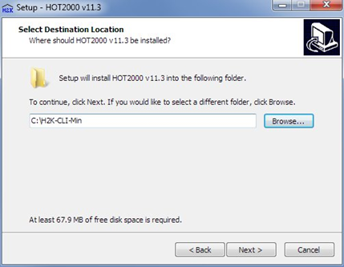
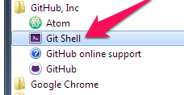

# **Introduction to HTAP**

**Batch run and optimization capabilities for HOT2000 V11.3 – Version of Jan 15, 2018.**

## Required software

HTAP depends on the following third-party components.

- Ruby: <http://rubyinstaller.org/> 
- Git: <https://git-scm.com/downloads>  

In addition to these, you may find the following tools useful: 

- A text file editor, such as notepad++
- A data analysis program, such as Matlab, tableau or excel. 

## HTAP installation and configuration

HTAP consists of two parts:

1. HOT2000 v11.3 (including command-line client) 
2. HTAP scripts and configuration files.

**a)** To download HOT2000 v11.3, visit <https://drive.google.com/drive/folders/1DY1Oae9-d9U8U-jxvRBB54EUM8Df8y-u>, and install these files in the following order:

1. vc_redist.x86.exe (install this one first)
2. HOT2000 v11.3b90 Setup.exe (if you don't already have it)
3. HOT2000-CLI v11.3b90 Setup.exe - **When prompted, set the destination location to C:\H2K-CLI-Min (as below)**  



**b)** To Install the HTAP scripts and configuration files, checkout the files from GitHub:

1. Open up the git shell from the start menu

   

2. Type in the following command from location `C:\>`

   ```powershell
   PS C:\> git clone https://github.com/NRCan-IETS-CE-O-HBC/HTAP HTAP
   Cloning into 'HTAP'...
   remote: Enumerating objects: 63, done.
   remote: Counting objects: 100% (63/63), done.
   remote: Compressing objects: 100% (45/45), done.
   remote: Total 3574 (delta 35), reused 36 (delta 18), pack-reused 3511
   Receiving objects: 100% (3574/3574), 17.76 MiB | 1.77 MiB/s, done.
   Resolving deltas: 100% (2427/2427), done.
   Checking out files: 100% (292/292), done.
   PS C:\>
   ```

   Git will create a new folder on your computer at location `C:\HTAP`. This folder will contain the HTAP scripts, some archetypes, and configuration files. 

3. Before you can run HTAP simulations, you must first copy the archetype files to the  `C:\H2K-CLI-Min\User\` directory. HTAP includes a ruby script to do this for you:

```powershell
C:\> cd .\HTAP\Archetypes\
C:\HTAP\Archetypes> ruby .\CopyToH2K.rb
>C:/HTAP/Archetypes
>> Copying ./1218N00240.h2k to C:\H2K-CLI-Min\User\... done.
>> Copying ./1218N00263.h2k to C:\H2K-CLI-Min\User\... done.
>> Copying ./1218N00264.h2k to C:\H2K-CLI-Min\User\... done.
>> Copying ./1218N00265.h2k to C:\H2K-CLI-Min\User\... done.
>> Copying ./1218N00288.h2k to C:\H2K-CLI-Min\User\... done.
>> Copying ./1218N00293.h2k to C:\H2K-CLI-Min\User\... done.
>> Copying ./1218N00398.h2k to C:\H2K-CLI-Min\User\... done.
>> Copying ./1218N00399.h2k to C:\H2K-CLI-Min\User\... done.
>> Copying ./1227D00169.h2k to C:\H2K-CLI-Min\User\... done.
>> Copying ./Arch-1-NZEH-detached-2-story.h2k to C:\H2K-CLI-Min\User\... done.
>> Copying ./Arch-2-BCLEEP-attached-endunit.h2k to C:\H2K-CLI-Min\User\... done.
>> Copying ./Arch-3-NZEH-detached-2-story-narrow.h2k to C:\H2K-CLI-Min\User\... done.
>> Copying ./Arch-4-MBLEEP-detached-bungalow.h2k to C:\H2K-CLI-Min\User\... done.
>> Copying ./BC-Step-LargeSFD.h2k to C:\H2K-CLI-Min\User\... done.
>> Copying ./BC-Step-MediumSFD.h2k to C:\H2K-CLI-Min\User\... done.
>> Copying ./BC-Step-MURB10.h2k to C:\H2K-CLI-Min\User\... done.
>> Copying ./BC-Step-MURB20.h2k to C:\H2K-CLI-Min\User\... done.
>> Copying ./BC-Step-NZEH-1-example.h2k to C:\H2K-CLI-Min\User\... done.
>> Copying ./BC-Step-Quad-BCH.h2k to C:\H2K-CLI-Min\User\... done.
>> Copying ./BC-Step-Quad-mkt.h2k to C:\H2K-CLI-Min\User\... done.
>> Copying ./BC-Step-rev-LargeSFD.h2k to C:\H2K-CLI-Min\User\... done.
>> Copying ./BC-Step-rev-MediumSFD.h2k to C:\H2K-CLI-Min\User\... done.
>> Copying ./BC-Step-rev-Murb1.h2k to C:\H2K-CLI-Min\User\... done.
>> Copying ./BC-Step-rev-Quad.h2k to C:\H2K-CLI-Min\User\... done.
>> Copying ./BC-Step-rev-Row.h2k to C:\H2K-CLI-Min\User\... done.
>> Copying ./BC-Step-rev-SmallSFD.h2k to C:\H2K-CLI-Min\User\... done.
>> Copying ./BC-Step-Row-11uBCH.h2k to C:\H2K-CLI-Min\User\... done.
>> Copying ./BC-Step-Row-mkt.h2k to C:\H2K-CLI-Min\User\... done.
>> Copying ./BC-Step-SmallSFD.h2k to C:\H2K-CLI-Min\User\... done.
>> Copying ./Habitat.h2k to C:\H2K-CLI-Min\User\... done.
>> Copying ./KelownaHouse.h2k to C:\H2K-CLI-Min\User\... done.
>> Copying ./Mattamy.h2k to C:\H2K-CLI-Min\User\... done.
>> Copying ./Minto-attached.h2k to C:\H2K-CLI-Min\User\... done.
>> Copying ./Minto-detached.h2k to C:\H2K-CLI-Min\User\... done.
>> Copying ./north-1227D00169.h2k to C:\H2K-CLI-Min\User\... done.
>> Copying ./NRCan-A11_1500sf_2storey_rowMid_fullBsmt.h2k to C:\H2K-CLI-Min\User\... done.
>> Copying ./NRCan-A9_3000sf_2stry_walkOut.h2k to C:\H2K-CLI-Min\User\... done.
>> Copying ./NRCan-arch10_1500sf_2storey_rowEnd_fullBsmt.h2k to C:\H2K-CLI-Min\User\... done.
>> Copying ./NRCan-arch1_1000sf_1storey_fullBsmt.h2k to C:\H2K-CLI-Min\User\... done.
>> Copying ./NRCan-arch2_1900sqft_1storey_crawlSpace.h2k to C:\H2K-CLI-Min\User\... done.
>> Copying ./NRCan-arch3_1300sf_2storey_fullBsmt.h2k to C:\H2K-CLI-Min\User\... done.
>> Copying ./NRCan-arch4_2100sf_2storey_fullBsmt.h2k to C:\H2K-CLI-Min\User\... done.
>> Copying ./NRCan-arch5_3500sf_2storey_fullBsmt.h2k to C:\H2K-CLI-Min\User\... done.
>> Copying ./NRCan-arch6_3500sf_2st_15%moreGlass_fullBsmt.h2k to C:\H2K-CLI-Min\User\... done.
>> Copying ./NRCan-arch7_2100sf_2storey_slabOnGrade.h2k to C:\H2K-CLI-Min\User\... done.
>> Copying ./NRCan-arch8_2100sf_2storey_walkOut.h2k to C:\H2K-CLI-Min\User\... done.
>> Copying ./PA-edmonton-example-01.h2k to C:\H2K-CLI-Min\User\... done.
>> Copying ./PA-edmonton-example-02.h2k to C:\H2K-CLI-Min\User\... done.
>> Copying ./PA-edmonton-example-03.h2k to C:\H2K-CLI-Min\User\... done.
>> Copying ./PA-edmonton-example-04.h2k to C:\H2K-CLI-Min\User\... done.
>> Copying ./PA-edmonton-example-05.h2k to C:\H2K-CLI-Min\User\... done.
>> Copying ./PA-edmonton-example-06.h2k to C:\H2K-CLI-Min\User\... done.
>> Copying ./PA-edmonton-example-07.h2k to C:\H2K-CLI-Min\User\... done.
>> Copying ./PA-edmonton-example-09.h2k to C:\H2K-CLI-Min\User\... done.
>> Copying ./PA-edmonton-example-10.h2k to C:\H2K-CLI-Min\User\... done.
>> Copying ./PA-edmonton-example-11.h2k to C:\H2K-CLI-Min\User\... done.
>> Copying ./PA-edmonton-example-12.h2k to C:\H2K-CLI-Min\User\... done.
>> Copying ./PA-edmonton-example-13.h2k to C:\H2K-CLI-Min\User\... done.
>> Copying ./PEER-OCH-197-Presland.h2k to C:\H2K-CLI-Min\User\... done.
>> Copying ./PEER-OCH-197to203-Presland-Block-v3.5.h2k to C:\H2K-CLI-Min\User\... done.
>> Copying ./PEER-OCH-199-Presland.h2k to C:\H2K-CLI-Min\User\... done.
>> Copying ./PEER-OCH-201-Presland.h2k to C:\H2K-CLI-Min\User\... done.
>> Copying ./PEER-OCH-203-Presland.h2k to C:\H2K-CLI-Min\User\... done.
>> Copying ./PH-example-1.h2k to C:\H2K-CLI-Min\User\... done.
>> Copying ./PH-example-3.h2k to C:\H2K-CLI-Min\User\... done.
>> Copying ./PH-example-4.h2k to C:\H2K-CLI-Min\User\... done.
>> Copying ./PH-example-8.h2k to C:\H2K-CLI-Min\User\... done.
>> Copying ./PH-example-9.h2k to C:\H2K-CLI-Min\User\... done.
>> Copying ./PrinceGeorgeHouse.h2k to C:\H2K-CLI-Min\User\... done.
>> Copying ./RHH.h2k to C:\H2K-CLI-Min\User\... done.
>> Copying ./Sloot.h2k to C:\H2K-CLI-Min\User\... done.
>> Copying ./V11_4b5NunavitBaseCase-PondInlet.h2k to C:\H2K-CLI-Min\User\... done.
>> Copying ./V11_4b5NunavutBaseCase-HallBeach.h2k to C:\H2K-CLI-Min\User\... done.
>> Copying ./V11_4b5NWTBaseCase-FortProvidence.h2k to C:\H2K-CLI-Min\User\... done.
>> Copying ./V11_4b5NWTBaseCase-Tuk.h2k to C:\H2K-CLI-Min\User\... done.
>> Copying ./V11_4b5YukonBaseCase-OldCrow.h2k to C:\H2K-CLI-Min\User\... done.
>> Copying ./V11_4b5YukonBaseCase-WatsonLake.h2k to C:\H2K-CLI-Min\User\... done.
>> Copying ./Voyer-L1-Left.h2k to C:\H2K-CLI-Min\User\... done.
>> Copying ./Voyer-L1-Right.h2k to C:\H2K-CLI-Min\User\... done.
>> Copying ./Voyer-L2-Left.h2k to C:\H2K-CLI-Min\User\... done.
>> Copying ./Voyer-L2-Right.h2k to C:\H2K-CLI-Min\User\... done.
>> Copying ./Voyer-L3-Left.h2k to C:\H2K-CLI-Min\User\... done.
>> Copying ./Voyer-L3-Right.h2k to C:\H2K-CLI-Min\User\... done.
>> Copying ./Voyer.h2k to C:\H2K-CLI-Min\User\... done.
>> Copying ./codeLib.cod to C:\H2K-CLI-Min\StdLibs\... done.
>> Copying ./FuelLib16.flc to C:\H2K-CLI-Min\StdLibs\... done.
PS C:\HTAP\Archetypes>
```

Note that the `CopyToH2k.rb` script will copy all HOT200 files and libraries from the `C:\HTAP\Archetypes` folder to `C:\H2K-CLI-Min\User`. To add additional archetypes to the HTAP platform, you merely need to copy them into `C:\HTAP\Archetypes`, and re-run the `CopyToH2k.rb` script.

## Verifying the installation 

1) **Test HOT2000 and the substitute-h2k.rb** script by running the following command from the `C:\HTAP\applications\training\single-cmd-line-run`  directory – abridged output appears below.

```powershell
PS C:\HTAP\applications\training\single-cmd-line-run> C:\HTAP\substitute-h2k.rb -c .\HOT2000.choices -o C:\HTAP\HTAP-options.json  -v

_________________________________________________________________________________________
= substitute-h2k: A wrapper for HOT2000 =================================================

 Input files:
         path: C:\HTAP\applications\training\single-cmd-line-run
         ChoiceFile: .\HOT2000.choices
         OptionFile: C:\HTAP\HTAP-options.json
         Base model: Not specified. Using archetype specified in .choice file
         HOT2000 source folder: C:\H2K-CLI-Min
         HOT2000 run folder: C:\HTAP\applications\training\single-cmd-line-run\H2K

_________________________________________________________________________________________
= substitute-h2k: Parsing input data ====================================================

Reading available options (C:\HTAP\HTAP-options.json)...done.

Reading user-defined choices (.\HOT2000.choices)...done.

 Specified choices:
 - Opt-DBFiles                         = H2KCodeLibFile
  - Opt-Location                        = NA
  - Opt-FuelCost                        = NA
  - Opt-ResultHouseCode                 = General
  - Opt-Archetype                       = SmallSFD
  - Opt-Ruleset                         = as-found
  - Opt-Specifications                  = NA
  - Opt-Baseloads                       = NA
  - Opt-Temperatures                    = NA
  - Opt-ACH                             = NA
  - Opt-Ceilings                        = NA
  - Opt-AtticCeilings                   = NA
  - Opt-CathCeilings                    = NA
  - Opt-FlatCeilings                    = NA
  - Opt-MainWall                        = NA
  - Opt-GenericWall_1Layer_definitions  = NA
  - Opt-FloorHeaderIntIns               = NA
  - Opt-ExposedFloor                    = NA
  - Opt-FoundationWallExtIns            = NA
  - Opt-FoundationWallIntIns            = NA
  - Opt-FoundationSlabBelowGrade        = NA
  - Opt-FoundationSlabOnGrade           = NA
  - Opt-CasementWindows                 = NA
  - Opt-Skylights                       = NA
  - Opt-DoorWindows                     = NA
  - Opt-Doors                           = NA
  - Opt-DHWSystem                       = NA
  - Opt-DWHRSystem                      = NA
  - Opt-HVACSystem                      = NA
  - Opt-HRVonly                         = NA
  - Opt-HRVspec                         = NA
  - Opt-H2K-PV                          = NA
  - Opt-WindowDistribution              = NA
  - GOconfig_rotate                     = S

_________________________________________________________________________________________
= substitute-h2k: Setting up HOT2000 environment ========================================

   UPDATED: Base model: C:\H2K-CLI-Min\User\BC-Step-rev-SmallSFD.h2k
            HOT2000 model file: BC-Step-rev-SmallSFD.h2k
            HOT2000 source folder: C:\H2K-CLI-Min
            HOT2000 run folder: C:\HTAP\applications\training\single-cmd-line-run\H2K
 Copying H2K folder to source
 Checking integrity of H2K installation
 + Attempt #1:
   - master:        219428d29c121312e0a52849e73b624b
   - working copy:  219428d29c121312e0a52849e73b624b (checksum match)

 Creating a copy of HOT2000 model (C:\H2K-CLI-Min\User\BC-Step-rev-SmallSFD.h2k for optimization work...

  (File C:\HTAP\applications\training\single-cmd-line-run\BC-Step-rev-SmallSFD.h2k created.)

_________________________________________________________________________________________
= substitute-h2k: Reading HOT2000 file ==================================================

 Parsing a copy of HOT2000 model (C:\HTAP\applications\training\single-cmd-line-run\BC-Step-rev-SmallSFD.h2k) for optimization work...done.
_________________________________________________________________________________________
= substitute-h2k: Processing Rulesets ===================================================

 Applying Ruleset as-found; as-found=:
  (a) AS FOUND: no changes made to model

 Replacing user-defined choices with rule set choices where appropriate...

_________________________________________________________________________________________
= substitute-h2k: Validating choices and options ========================================
 Choices that will be used in the simulation:
 - Opt-DBFiles                         = H2KCodeLibFile
  - Opt-Location                        = NA
  - Opt-FuelCost                        = NA
  - Opt-ResultHouseCode                 = General
  - Opt-Archetype                       = SmallSFD
  - Opt-Ruleset                         = as-found
  - Opt-Specifications                  = NA
  - Opt-Baseloads                       = NA
  - Opt-Temperatures                    = NA
  - Opt-ACH                             = NA
  - Opt-Ceilings                        = NA
  - Opt-AtticCeilings                   = NA
  - Opt-CathCeilings                    = NA
  - Opt-FlatCeilings                    = NA
  - Opt-MainWall                        = NA
  - Opt-GenericWall_1Layer_definitions  = NA
  - Opt-FloorHeaderIntIns               = NA
  - Opt-ExposedFloor                    = NA
  - Opt-FoundationWallExtIns            = NA
  - Opt-FoundationWallIntIns            = NA
  - Opt-FoundationSlabBelowGrade        = NA
  - Opt-FoundationSlabOnGrade           = NA
  - Opt-CasementWindows                 = NA
  - Opt-Skylights                       = NA
  - Opt-DoorWindows                     = NA
  - Opt-Doors                           = NA
  - Opt-DHWSystem                       = NA
  - Opt-DWHRSystem                      = NA
  - Opt-HVACSystem                      = NA
  - Opt-HRVonly                         = NA
  - Opt-HRVspec                         = NA
  - Opt-H2K-PV                          = NA
  - Opt-WindowDistribution              = NA
  - GOconfig_rotate                     = S

_________________________________________________________________________________________
= substitute-h2k:  Manipulating HOT2000 file  ===========================================
 Performing substitutions on H2K file...done.
_________________________________________________________________________________________
= substitute-h2k: Running HOT2000 simulations ===========================================

 Attempt #1:  Invoking HOT2000 (PID 2424) ... Hot2000 (PID: 2424) finished with exit status 0
 The run was successful (5.86 seconds)!

 Copying results.
 Loading XML elements from C:\HTAP\applications\training\single-cmd-line-run\BC-Step-rev-SmallSFD.h2k ...
 Parsing results from set: General ... done

_________________________________________________________________________________________
= substitute-h2k: Simulation Results ====================================================

 Peak Heating Load (W): 5570.7
 Peak Cooling Load (W): 1931.4

 Energy Consumption:

  16.5 ( Space Heating, GJ )
  19.7 ( Hot Water, GJ )
  0.7 ( Ventilator Electrical, GJ )
  0.0 ( Space Cooling, GJ )
  25.6 ( Appliances + Lights + Plugs + outdoor, GJ )
 --------------------------------------------------------
  62.4 ( H2K Gross energy use GJ )
       ( Check1: should = 62.4, Check2: avgEnergyTotalGJ = 62.4 )

 Energy Cost (not including credit for PV, direction  ):

  + $ 727.4  (Electricity)
  + $ 310.85 (Natural Gas)
  + $ 0.0  (Oil)
  + $ 0.0  (Propane)
  + $ 0.0  (Wood)
 --------------------------------------------------------
    $ 1038.25  (All utilities).

  - $ 0.0 (**Net PV revenue for 0 kW unit: 0 kWh at $ 0.1 / kWh)
 --------------------------------------------------------
    $ 1038.25 (Net utility costs).

 Total Energy Use by Fuel (in fuel units, not including credit for PV, direction  ):

  - 7383 (Total Electricity, kWh)
  - 963 (Total Natural Gas, m3)
  - 0 (Total Oil, l)
  - 0 (Total Propane, l)
  - 0 (Total Wood, cord)

_________________________________________________________________________________________
= substitute-h2k: Cost Impacts ==========================================================
 ........................................................................................
 Option                                Choice      Cost
 ........................................................................................
  Opt-Ceilings                         NA   $\      0.00
  Opt-AtticCeilings                    NA   $\      0.00
  Opt-ACH                              NA   $\      0.00
  Opt-CasementWindows                  NA   $\      0.00
  Opt-DWHRSystem                       NA   $\      0.00
  Opt-GenericWall_1Layer_definitions   NA   $\      0.00
  Opt-HVACSystem                       NA   $\      0.00
  Opt-HRVonly                          NA   $\      0.00
  Opt-DHWSystem                        NA   $\      0.00
  Opt-FoundationWallExtIns             NA   $\      0.00
  Opt-FoundationWallIntIns             NA   $\      0.00
  Opt-FoundationSlabBelowGrade         NA   $\      0.00
  Opt-FoundationSlabOnGrade            NA   $\      0.00
  Opt-FloorHeaderIntIns                NA   $\      0.00
  Opt-ExposedFloor                     NA   $\      0.00
 ........................................................................................
 Total                                      $\      0.00

_________________________________________________________________________________________
= substitute-h2k: Run Summary ===========================================================

 Total processing time: 11.5 seconds
 -> Informational messages:

   (-) Info - Option Opt-H2KFoundation was not specified in Choices file OR rule set;  Using default value (NA)

   (-) Info - Option Opt-H2KFoundationSlabCrawl was not specified in Choices file OR rule set;  Using default value (NA)

   (-) Info - Comprehensive costing calculation report written to HTAP-costing-audit-report.txt

 -> Warning messages:
   (nil)
 -> Error messages:
   (nil)
 STATUS: Task completed successfully
=========================================================================================
PS C:\HTAP\applications\training\single-cmd-line-run>
```

## Application — running a HOT2000 single simulation

HTAP provides a means to run HOT2000 from the command line using the `substitute-h2k.rb` script.  The syntax is:

```powershell
PS C:\HTAP> .\substitute-h2k.rb [-v] –o OPTIONS-FILE –c CHOICE-FILE
```

- The *substitute-h2k.rb* script is the pre- and post-processor that automates HOT2000. It can manipulate HOT2000 input files, start HOT2000 simulations, and parse HOT2000 outputs. 
- The *OPTIONS-FILE* defines all of the attributes within a HOT2000 model that can be manipulated via HTAP, and the valid values that they can be set to. It also contains cost data for upgrade specifications. 
- The *CHOICE-FILE* defines the values that each HOT2000 parameter should be set to in the current simulation.

### The `HTAP-options.json` file 

Most of HTAP’s data are stored in the `.options` file.  The option file contains a list of attributes that HTAP can edit within HOT2000 input (.h2k) file. An excerpt from the `HTAP-options.json`  file follows

```json
"Opt-H2K-PV": {
    "structure": "tree",
    "costed": true,
    "options": {
      "NA": {
        "h2kMap": {
          "base": {
            "Opt-H2K-Area": "NA",
            "Opt-H2K-Slope": "NA",
            "Opt-H2K-Azimuth": "NA",
            "Opt-H2K-PVModuleType": "NA",
            "Opt-H2K-GridAbsRate": "NA",
            "Opt-H2K-InvEff": "NA"
          }
        },
        "costs": {
          "custom-costs": {
          },
          "components": [

          ]
        }
      },
      "MonoSi-5kW": {
        "h2kMap": {
          "base": {
            "Opt-H2K-Area": "53",
            "Opt-H2K-Slope": "18.4",
            "Opt-H2K-Azimuth": "0",
            "Opt-H2K-PVModuleType": "1",
            "Opt-H2K-GridAbsRate": "90",
            "Opt-H2K-InvEff": "90"
          }
        },
        "costs": {
          "custom-costs": {
          },
          "components": [

          ]
        }
      },
      "MonoSi-10kW": {
        "h2kMap": {
          "base": {
            "Opt-H2K-Area": "107",
            "Opt-H2K-Slope": "18.4",
            "Opt-H2K-Azimuth": "0",
            "Opt-H2K-PVModuleType": "1",
            "Opt-H2K-GridAbsRate": "90",
            "Opt-H2K-InvEff": "90"
          }
        },
        "costs": {
          "custom-costs": {
          },
          "components": [

          ]
        }
      },
      "MonoSi-200m2": {
        "h2kMap": {
          "base": {
            "Opt-H2K-Area": "200",
            "Opt-H2K-Slope": "43",
            "Opt-H2K-Azimuth": "0",
            "Opt-H2K-PVModuleType": "1",
            "Opt-H2K-GridAbsRate": "90",
            "Opt-H2K-InvEff": "90"
          }
        },
        "costs": {
          "custom-costs": {
          },
          "components": [

          ]
        }
      },
      "R2000_test": {
        "h2kMap": {
          "base": {
            "Opt-H2K-Area": "0",
            "Opt-H2K-Slope": "0",
            "Opt-H2K-Azimuth": "0",
            "Opt-H2K-PVModuleType": "1",
            "Opt-H2K-GridAbsRate": "90",
            "Opt-H2K-InvEff": "90"
          }
        },
        "costs": {
          "custom-costs": {
          },
          "components": [

          ]
        }
      }
    },
    "default": "NA",
    "stop-on-error": true,
    "h2kSchema": [
      "Opt-H2K-Area",
      "Opt-H2K-Slope",
      "Opt-H2K-Azimuth",
      "Opt-H2K-PVModuleType",
      "Opt-H2K-GridAbsRate",
      "Opt-H2K-InvEff"
    ]
  },
```
This section defines data for the Opt-H2K-PV attribute.  Three options are available: NA, MonoSi-5kW, and MonoSi-10kW.  Throughout the `Substitute-h2k.rb` interprets the NA specification as instructions to leave the existing .h2k file unaltered – that is, the values for those inputs that were provided when the file was saved in HOT2000 will be preserved when the file is run in HTAP. 

The remainder of the data for each attribute describe tags, values, and costs. Each tag identifies a key word that substitute-h2k.rb associates with part of the HOT2000 data model. For instance, `Opt-H2K-InvEff` refers to the inverter efficiency of PV modules. Each value provides the alphanumeric input that must be substituted within the .h2k file. For example, the inverter efficiency will be set to 90% for the MonoSI-10kW case in the snippet above. 

**TODO:** Table defining all HTAP options to be inserted here. 

**TODO:** Add note on costing .

### The `Sim.choice` file 

The `.choice` file contains a token-value list that defines the option that HTAP should use for each attribute.  The syntax for each is *TOKEN : VALUE*, and comments are denoted with a exclamation mark (!).  Entries in the choice file must obey the following rules:

- Each token must match one of the attributes in the .options file
- Each value must match on of the options given for that attribute in the .options file
- NA values instruct the `substitute-h2k.rb` script to leave the associated data in the .h2k file alone – that is, whatever inputs were provided when the file was created in HOT2000 will be used in the HTAP simulation.

An example .choice file follows. In this example, the .choice file instructs HTAP to replace the heating system with a cold-climate air source heat pump, the DHW system with a heat pump water heater, and to add a drain-water heat recovery device. All other inputs are left unchanged. 

```
! Choice file for run $gGenChoiceFileNum
Opt-Location : VANCOUVER 
!Opt-Archetype : ERS-1607.H2K 
Opt-Ruleset : as-found 
Opt-FuelCost : NA 
Opt-ResultHouseCode : General 
Opt-Specifications : NBC_Specs_Normal 
Opt-Baseloads : ERS-Single-regular-19.5kWh&190_per_day 
Opt-Temperatures : NBC_Temps 
Opt-ACH : ACH_NBC 
Opt-CasementWindows : NBC-zone4-window 
Opt-Skylights : NA 
Opt-DoorWindows : NBC-zone4-Doorwindow 
Opt-Doors : NBC-zone4-door 
Opt-MainWall : NA 
Opt-GenericWall_1Layer_definitions : NBC_Wall_zone4 
Opt-FloorHeaderIntIns : NBC_RSI2.78_int 
Opt-FoundationWallExtIns : NBC_936_uninsulated_EffR0 
Opt-FoundationWallIntIns : NBC_936_1.99RSI 
Opt-FoundationSlabBelowGrade : NBC_936_uninsulated_EffR0 
Opt-FoundationSlabOnGrade : NBC_936_1.96RSI 
Opt-ExposedFloor : NBC_936_4.67RSI 
Opt-Ceilings : NA 
Opt-AtticCeilings : NBC_Ceiling_zone4 
Opt-CathCeilings : NBC_CathCeiling_RSI4.67 
Opt-FlatCeilings : NBC_FlatCeiling_RSI4.67 
Opt-HRVonly : NBC_HRV 
Opt-HRVspec : NA 
Opt-DHWSystem : NBC-HotWater_elec 
Opt-HVACSystem : NBC-elec-heat 
Opt-DWHRSystem : NA 
Opt-H2K-PV : NA 
Opt-WindowDistribution : NA 
GOconfig_rotate : S 
Opt-DBFiles : H2KCodeLibFile 
```

## Application — running BATCH analysis

A `.run` file defines how each attribute should be varied during a batch run, and the strategy that should be used to examine the solution space. The run file specifies the algorithm that HTAP will use to explore the solution space. three algorithms are commonly used:

- **Parametric:** HTAP evaluates the sensitivity of the model to the proposed changes by varying each parameter one at a time 
- **Mesh:** HTAP evaluates all combinations of parameters in the `.run` file to fully explore the solution space 
- **Sample**: HTAP selects a random sample from all possible combinations.

### The `.Run` file

The `.run` file specifies the simulation mode, archetypes, simulation locale, rulesets, and choices. The
following is a sample `.run` file:


```matlab
! Definitions file for HTAP-PRM RUN 

! Run-Mode: Parameters that affect how htap-prm is configured. 
RunParameters_START
  run-mode                           = mesh 
  archetype-dir                      = C:/HTAP/Archetypes
RunParameters_END 

! Parameters controlling archetypes, locations, reference rulests. (these will always be
! run in mesh, even if anoptimization mode is added in the future. 

RunScope_START

  archetypes                        = *.H2K
  locations                         = NA
  rulesets                          = as_found, NBC9_36_HRV, NBC9_36_noHRV

RunScope_END

! Parameters controlling the design of the building 
Upgrades_START
  Opt-FuelCost                       = rates2016  ! Maybe this belongs in scope?
  Opt-ACH                            = NA
  Opt-MainWall                       = NA
  Opt-GenericWall_1Layer_definitions = NA
  Opt-Ceilings                       = NA
  Opt-AtticCeilings                  = NA
  Opt-CathCeilings                   = NA
  Opt-FlatCeilings                   = NA	
  Opt-H2KFoundation                  = NA
  Opt-ExposedFloor                   = NA
  Opt-CasementWindows                = NA
  Opt-H2K-PV                         = NA
  Opt-Skylights                      = NA   
  Opt-Doors                          = NA
  Opt-DoorWindows                    = NA
  Opt-RoofPitch                      = NA
  Opt-DHWSystem                      = NA
  Opt-DWHRSystem                     = NA
  Opt-HVACSystem                     = NA 
  Opt-HRVspec                        = NA
  Opt-StandoffPV                     = NoPV
  GOconfig_rotate                    = S
  Opt-DBFiles                        = H2KCodeLibFile
  Opt-ResultHouseCode                = General
  Opt-FloorHeader                    = NA
  Opt-H2KFoundationSlabCrawl         = NA
  Opt-HRVduct                        = interlock
  Opt-DHWLoadScale                   = No-Reduction
  Opt-Baseloads                      = NA
Upgrades_END
```


## Troubleshooting

*TBA*

## Contents of the HTAP directory

| Tag                   | Description                                                  | Type      |
| --------------------- | ------------------------------------------------------------ | --------- |
| Applications          | Contains examples, and files associated with NRCan projects[^1] | Directory |
| Archetypes            | Contains HOT2000 archetype files (.h2k), as well as fuel and construction libraries | Directory |
| Doc                   | Contains documentation on HTAP                               | Directory |
| testing               |                                                              | Directory |
| coax-cost-data.rb     |                                                              | File      |
| CreateCostDataFile.rb |                                                              | File      |
| HTAP-options.json     |                                                              | File      |
| htap-prm.rb           |                                                              | File      |
| HTAPUnitCosts.json    |                                                              | File      |
| merge-json.rb         |                                                              | File      |
| substitute-h2k.rb     |                                                              | File      |
|                       |                                                              |           |

[^1]: These may be implemented as a separate git submodule in the future.

